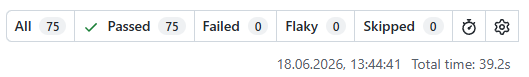

В тестовом ничего не сказано по ожиданиям от тестового кроме тз, сделал в указанном стеке вакансии

Некоторые тесты могут отваливаться из-за race condition, пофиксил в тех местах где локально ловил, но особо не запаривался, т.к вообще нет гарантии что тестовое посмотрят.
Не стал использовать TS т.к в данных кейсах не вижу смысла, если будет комментарий прошу оставить в обратной связи

Запуск стантартный, npm i -> npx playwright test

дублирую контакт, стандартно проверяю чат на hh раз в день-два, https://t.me/ZioGrape
